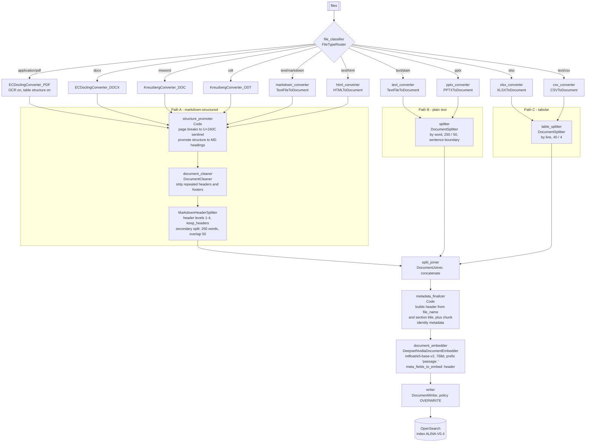
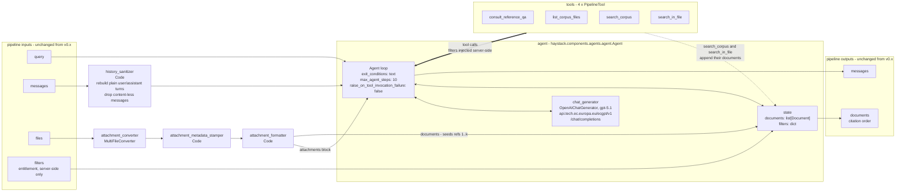
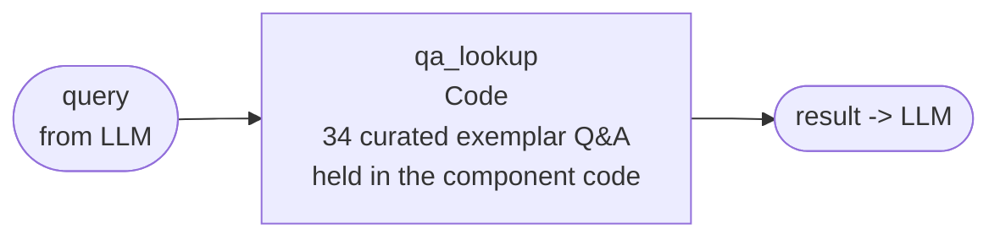
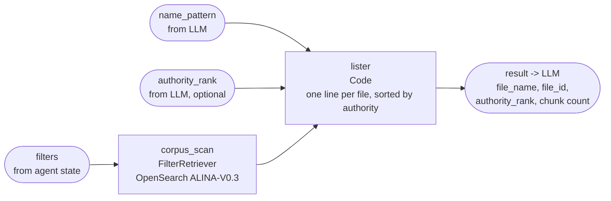
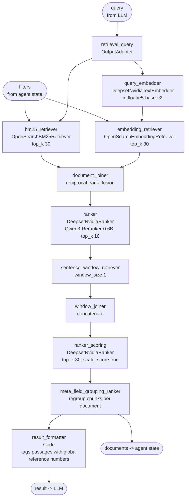
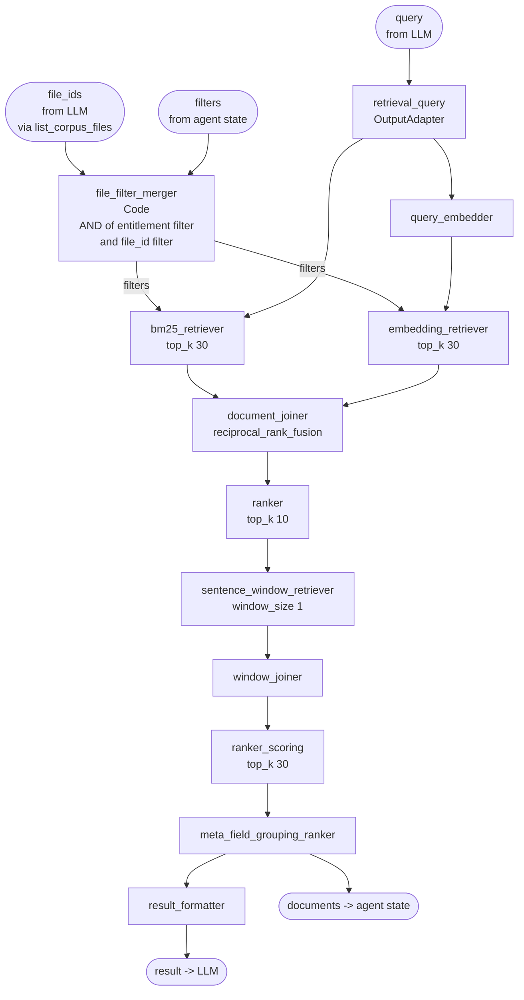
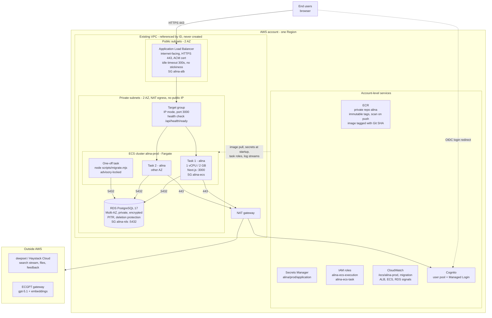

# ALINA - Architecture diagrams

Source of truth for each diagram:

| Diagram | Generated from | Version |
|---|---|---|
| 1. Indexing pipeline | `docs/Haystack-pipelines/indexing-v06.yaml` | v0.6, 02/09/2026 |
| 2. Agent pipeline (top level) | `alina-pipeline-v1-draft9-reference-qa.yaml` | v1 draft 9, 07/09/2026 |
| 3. Agent tools (internals) | same | v1 draft 9 |
| 4. AWS architecture | `docs/aws-production-runbook.md` | 04/09/2026 |

---

## 1. Indexing pipeline (Haystack v0.6)

One deepset indexing pipeline. A file is routed by MIME type into one of three
preprocessing paths, then all three converge on a single finalize-embed-write tail.

**Notes**

- `structure_promoter` must run before `document_cleaner`: it swaps `\f` for a
  printable sentinel the cleaner cannot collapse, and promotes PART / TITLE /
  CHAPTER / SECTION / Article to markdown headings so `MarkdownHeaderSplitter`
  has something to cut on. Four profiles, because legal acts are only 4% of the corpus.
- `metadata_finalizer` is the single place where a chunk's queryable identity is
  decided. `header` is used on the query side both as the human label and inside
  `meta_fields_to_embed`.
- **Open point:** this pipeline writes to `ALINA-V0.4`; the v1 agent pipeline
  still reads `ALINA-V0.3`. The two must be bumped in the same deployment.

---

## 2. Agent pipeline (Haystack v1)

The pipeline contract is identical to v0.x - same sockets in, same sockets out -
so the application does not change. Everything between them is rebuilt around one
`haystack.components.agents.agent.Agent`.

**Notes**

- `filters` carries the entitlement filter. It enters the agent as a **state
  field** and is injected into every tool server-side: the LLM never sees it and
  cannot set it. This is the only mechanism isolating a user's documents.
- `history_sanitizer` exists because deepset replays chat history itself. An
  `Agent` hands that list straight to the generator, which rejects any
  content-less `ChatMessage` on outgoing serialization.
- The generator is `OpenAIChatGenerator` (`/chat/completions`) and not
  `OpenAIResponsesChatGenerator` (`/responses`): the ECGPT gateway does function
  calling on the former only, established by isolation test on 31/08/2026.
- Nominal path is `consult_reference_qa` then `search_in_file` then
  `search_corpus` then answer, which is why `max_agent_steps` is 10.

---

## 3. Agent tools - internals

All four tools are `haystack.tools.pipeline_tool.PipelineTool`. Each wraps a
nested Haystack pipeline; `outputs_to_string` selects what the LLM actually reads.

### 3.1 consult_reference_qa

Called first for any substantive procurement question. Returns the closest
curated entries and the instruments they rely on, which tells the agent which
document to search. The entries are **guidance, never a citable source**.

### 3.2 list_corpus_files

Resolves a document name, alias or abbreviation to an exact `file_id` before
`search_in_file`. Authority ranks: 1 legal acts, 2 internal rules and circulars,
3 guidance and vademecum, 4 tender and contract documents, 5 Q&A logs.

### 3.3 search_corpus - the v0.x retrieval chain, wrapped as a tool

### 3.4 search_in_file - same chain, constrained to named files

**Why the two chains are duplicated rather than shared:** a `PipelineTool` owns
its nested pipeline. The only difference is `file_filter_merger`, which merges
the LLM-supplied `file_ids` into the state-supplied entitlement filter with `AND`
before either retriever sees it. The entitlement half is never under LLM control.

---

## 4. AWS architecture (production)

**Constraints and invariants**

- The landing zone does **not** allow creating VPCs or subnets. Network
  resources are referenced by ID. Security groups `alina-alb` / `alina-ecs` /
  `alina-rds` are requested from the platform team where they do not already
  exist.
- ECS tasks run in private subnets with no public IP. Outbound HTTPS through the
  NAT gateway is required: the application calls Cognito, Haystack and ECGPT.
- RDS is never publicly accessible. Only `alina-ecs` may reach port 5432. TLS is
  validated against the RDS CA bundle embedded in the image.
- Connection budget: `DB_POOL_MAX x ECS_MAX_TASKS < RDS_MAX_CONNECTIONS - 20`.
- Release sequence: push a new SHA image, register a task-definition revision,
  run that revision once as a migration task, wait for exit code 0, then update
  the service. Schema changes follow expand / migrate / contract so old and new
  tasks can run concurrently during the rolling deployment.
- No RDS Proxy, no Terraform, no CDK: the runbook is deliberately console-driven.
