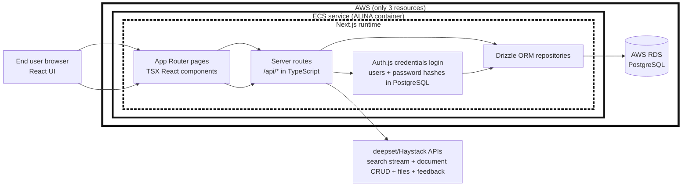

# ALINA - Short Architecture Note

## 1) High-Level Architecture

  ## 2) AWS Resources (Scope)

  Only these two AWS resources are used by this architecture:

  - ECS: runs the ALINA Docker container (Next.js UI + server/API runtime).
  - RDS: managed PostgreSQL database for persisted application data,
    including user accounts and password hashes.

  No other AWS runtime resource is part of this architecture note. Amazon
  Cognito was used for authentication until September 2026 and has been
  replaced by application-managed accounts (see README, "Authentication and
  User Management"). The same container and database can also run on Railway
  (see `docs/railway-deployment-guide.md`).

  ## 3) Programming Languages

- Server language: TypeScript running on Node.js via Next.js server runtime.
- UI language: TypeScript + TSX (React 19 components with Next.js App Router).
- Data/DB layer: TypeScript (Drizzle ORM) with PostgreSQL as database engine.
- Supporting scripts: JavaScript (Node `.mjs`) and Python (metadata/build helper scripts), but these are auxiliary and not the main web runtime.

## 4) Runtime Roles

- Browser/UI: renders chat and document-management interfaces.
- Next.js server: hosts pages and API routes, keeps secrets server-side, proxies requests to Haystack APIs.
- Auth.js with a Credentials provider: sign-in against the `users` table (scrypt password hashes), JWT session cookie, account lockout and disable handled in the application.
- RDS PostgreSQL: conversation/project persistence.
- Haystack/deepset Cloud: retrieval pipeline and document/file operations.

## 5) File Scope and Retrieval

Every managed file has one immutable scope:

- `global`: available in global chat and every project chat.
- `project`: available only in projects recorded in `project_files`.

Files already present in Haystack without a local `managed_files` record are treated as legacy global files. Uploads from the Documents page create global files. Uploads from a project require project-admin access, create project files, and immediately assign them to that project.

PostgreSQL is authoritative for file scope and project assignments. Haystack file metadata stores a retrieval projection in `alina_scope` and `alina_project_ids`. The latter is an access-token list: global files contain `global`, while project files contain their assigned project IDs. Global conversations filter for the `global` token. Project conversations filter for either `global` or the authorized project ID with one `in` comparison. Authority-rank filters are combined with this access filter using `AND`. The request size therefore remains constant as the corpus grows.

`HAYSTACK_ACCESS_METADATA_FILTERS_ENABLED` gated the query-time cutover from the legacy explicit `files` allowlist to metadata filtering. It is now permanently enabled: the pipeline's `files` request field turned out not to be honored by the retriever at all (verified by direct testing — results ignored it completely), so the metadata-filter path is the only working isolation mechanism and the search-stream route no longer branches on this flag. Keep `pnpm haystack:access:check` reporting zero file-metadata drift after any bulk file changes or reindex.

Uploads write the access projection before their first indexing. Project assignment changes update PostgreSQL and Haystack metadata with compensation and reconciliation on partial failure. Unmanaged legacy Haystack files are classified as global by the backfill and must be reindexed once so the new token reaches indexed documents. Unassigned project files have an empty access-token list and are used by no conversation; they remain visible only to their owner or an application administrator.

Project admins can remove assignments. Assigning a project file to another project additionally requires file ownership or application-admin access. File metadata updates and permanent deletion remain owner/application-admin operations; permanent deletion removes every project assignment.