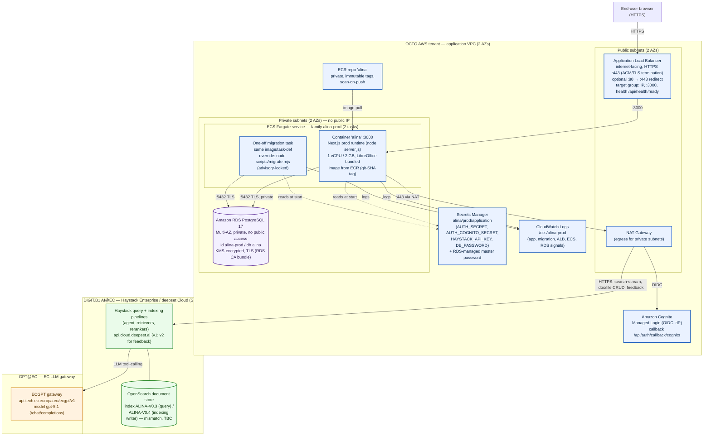

> **Superseded (September 2026):** authentication no longer uses Amazon Cognito. Accounts, passwords and roles are managed inside ALINA (PostgreSQL `users` table, Auth.js Credentials provider). Skip every Cognito step and the `AUTH_COGNITO_*` / `AUTH_POST_LOGOUT_URL` variables below; see the README section "Authentication and User Management".

# Diagram A — Deployment / Infrastructure View

> Trust boundaries: **OCTO AWS tenant** (application), **DIGIT.B1 AI@EC / Haystack SaaS tenant** (retrieval), **GPT@EC** (LLM gateway). Region is operator-chosen and not hardcoded (TBC).

## Caption

ALINA runs as a single Next.js container image (pulled from a private ECR repository, git-SHA tagged) on ECS Fargate in the OCTO AWS tenant, fronted by an internet-facing HTTPS Application Load Balancer that terminates TLS in the public subnets and forwards to two Fargate tasks on port 3000 in private subnets. Application state persists in a Multi-AZ RDS PostgreSQL 17 instance reached over TLS on 5432; database schema changes run as a one-off migration task built from the same image with a `node scripts/migrate.mjs` command override. Secrets (auth, Haystack API key, DB password) are injected from AWS Secrets Manager at task start, container logs go to the CloudWatch log group `/ecs/alina-prod`, and all outbound calls from the private subnets — OIDC to Amazon Cognito and HTTPS to the Haystack SaaS backend — egress through a NAT gateway. Retrieval itself lives in the DIGIT.B1 AI@EC / Haystack (deepset Cloud) SaaS tenant, whose pipelines call the GPT@EC gateway (`api.tech.ec.europa.eu/ecgpt/v1`, model `gpt-5.1`) for the agent's LLM steps.

## Could not confirm from the sources

- **AWS Region** — chosen and recorded by the operator; no region is hardcoded in the repo.
- **Haystack/deepset base URL** — confirmed in the application code as `https://api.cloud.deepset.ai` (v1 for files/pipelines/chat-stream/search_sessions/temporary_files; v2 for feedback). The deployment runbook itself does not name it. Whether this SaaS instance is the "Haystack Enterprise" tenant operated by DIGIT.B1 (vs. public deepset Cloud) is not evidenced.
- **Whether Cognito is in the same OCTO AWS account** as the app resources — it is an AWS-native service configured for this app, but account ownership/segregation is not stated; drawn inside the OCTO tenant on that assumption.
- **NAT gateway count** (one shared vs one per AZ) — docs say private subnets egress via NAT but do not specify the number.
- **Index-name mismatch** — the indexing pipeline's writer targets `ALINA-V0.4` while the query pipeline reads `ALINA-V0.3`; both YAMLs flag this as an intended-but-not-yet-completed bump. Shown as a discrepancy, not resolved.
- **GPT@EC network path** — whether the Haystack→GPT@EC call is tenant-internal to AI@EC or traverses the public internet is not evidenced.
- No Terraform/CloudFormation/CDK exists; infrastructure is described in console-driven prose only, so resource wiring is transcribed from the runbook rather than from declarative IaC.
