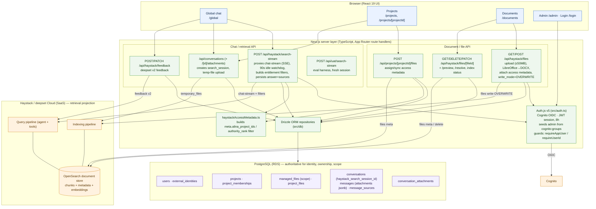

# Diagram B — Application Components View

> Next.js App Router app (`src/app`). Route protection is per-handler (`requireAppUser` / `requireUserId`); there is **no** `middleware.ts`. All Haystack calls are server-side proxies to `api.cloud.deepset.ai`.

## Responsibility ownership

| Concern | Owner |
|---|---|
| Authentication & session | Auth.js + Cognito OIDC (`src/auth.ts`); JWT session, 8h; admin seeded from `cognito:groups` |
| Authorization | Per-handler `requireAppUser` / `requireUserId` (no middleware) |
| Chat streaming & answer persistence | `/api/haystack/search-stream` (SSE proxy → deepset chat-stream) |
| Entitlement filter construction | `haystackAccessMetadata.ts` (`meta.alina_project_ids ∈ [global, projectId]`, optional `authority_rank`) |
| Identity, ownership, scope, history | PostgreSQL via Drizzle (authoritative) |
| Retrieval + chunk/metadata/embedding store | Haystack / deepset Cloud + OpenSearch (projection) |
| Upload + format conversion | `/api/haystack/files` (LibreOffice → DOCX, ≤50MB) |

## Caption

The three UI tabs — global chat (`/global`), projects (`/projects`), and documents (`/documents`) — are React pages that call TypeScript route handlers in the same Next.js server; there is no separate backend and no route middleware, so every handler enforces auth itself via `requireAppUser`/`requireUserId` on top of an Auth.js Cognito-OIDC JWT session. The chat handler `/api/haystack/search-stream` builds the per-user/per-project entitlement filter, proxies the request to the deepset chat-stream pipeline as Server-Sent Events, and persists the assistant message and its citations back to PostgreSQL. PostgreSQL (via Drizzle ORM) is authoritative for users, projects, memberships, file ownership/scope, conversations, messages, and citations, while Haystack/deepset Cloud with its OpenSearch document store holds only the retrieval projection (chunks, metadata, embeddings). Document and file operations — upload with LibreOffice→DOCX conversion, metadata edits, deletion, and project assignment — are separate handlers under `/api/haystack/files*` and `/api/projects/[projectId]/files` that write to both PostgreSQL and Haystack file metadata.

## Could not confirm from the sources

- **Project-level authorization completeness** — CLAUDE.md flags that file/document CRUD and project-scoped mutations may lack full project-role checks (pending Aug-11 audit); the handlers use `requireAppUser`/`requireUserId` but per-route project-role enforcement was not exhaustively verified here.
- **`alina_scope` vs `file_id` filter field** — the app builds filters on `meta.alina_project_ids` / `meta.authority_rank`, but CLAUDE.md states no custom `alina_*` fields are relied upon for retrieval, and the query pipeline's `search_in_file` merges on intrinsic `file_id`. These three sources disagree on the exact metadata field; drawn as "access metadata filter" without asserting one canonical field.
- **`search_sessions` table** — does **not** exist as a standalone table (contrary to CLAUDE.md); the session UUID lives on `conversations.haystack_search_session_id`. Shown that way.
- **UAT harness placement in production** — `/api/uat/search-stream` exists in the codebase; whether it is exposed in the production deployment is not evidenced.
- Exact React component composition per tab is not detailed (page-level routes only).
