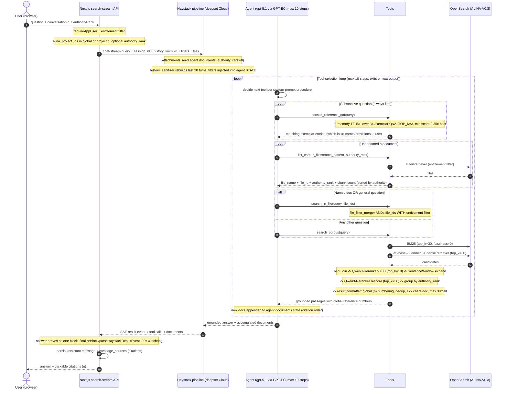

# Diagram C — Agentic Query Flow (sequence)

> Source: `pipeline_querying_v11.yaml` (v1 agent, DRAFT 9b) + `search-stream/route.ts`. Tool names, parameters, retriever/reranker settings taken verbatim from the YAML.

## Caption

A user question enters through `/api/haystack/search-stream`, which authenticates the caller, constructs the per-user/per-project entitlement filter, and forwards the query (with `search_session_id`, a 20-message history limit, and any attachment file IDs) to the Haystack agent pipeline as an SSE stream. The Haystack Agent (an `OpenAIChatGenerator` targeting `gpt-5.1` on the GPT@EC gateway, bounded to `max_agent_steps: 10`) runs a tool-selection loop following its system-prompt procedure: `consult_reference_qa` first for guidance, `list_corpus_files` to resolve any named document, then `search_in_file` or `search_corpus`, each of which executes the same hybrid pipeline — BM25 (top_k 30) plus e5-base-v2 dense retrieval (top_k 30) fused by reciprocal rank fusion, reranked by a Qwen3-Reranker-0.6B model (top_k 10), sentence-window expanded, rescored, grouped by authority rank, and formatted with global citation numbers. The request's entitlement `filters` are injected server-side into the agent's state and ANDed into every tool's retrieval, so the LLM can never widen its own access; `search_in_file`'s `file_filter_merger` ANDs any model-chosen `file_ids` with those filters. When the agent emits text (its exit condition), the accumulated grounded passages and answer stream back; the front end persists the assistant message and its `message_sources` and renders clickable `[n]` citations.

## Could not confirm from the sources

- **Token-by-token streaming** — `streaming_callback` is commented out in the agent config (DRAFT 7); the YAML says answers currently arrive as a single result block and the app's `finalizeBlock` path copes. Whether streaming has since been re-enabled in the deployed pipeline is not evidenced.
- **`reasoning_effort`** — disabled in the YAML (`generation_kwargs: {}`) as a diagnostic; the comments say to restore `medium` once green, but the deployed value is unknown.
- **Exact entitlement filter field at the boundary** — the app sends `meta.alina_project_ids`; the pipeline's `file_filter_merger` uses intrinsic `file_id`; the YAML itself flags this field-spelling as needing verification against the route. The `filters` payload's precise shape as consumed by the retrievers is therefore TBC.
- **GPT@EC latency / tool-calling reliability** — the YAML documents an extended history of empty-message / tool-call failures through the ECGPT gateway; whether the deployed pipeline is fully stable is not asserted here.
- **Index version served** — query pipeline reads `ALINA-V0.3` while indexing writes `ALINA-V0.4`; the live index behind the agent is TBC.
