# Diagram D — Indexing / Ingestion Flow

> Source: `pipeline_indexing_v11.yaml` (v0.6). Component names, chunk sizes, overlaps, models, and index name taken verbatim from the YAML.

```mermaid
flowchart TB
    UP["Upload (Documents page = global · project page = project)<br/>POST /api/haystack/files → deepset files (write_mode=OVERWRITE)<br/>≤50MB; DOC/ODT → DOCX via LibreOffice server-side<br/>access metadata attached before first indexing"]
    UP --> FC

    FC["file_classifier<br/>FileTypeRouter (raise_on_failure=false)"]

    %% converters
    FC -->|text/plain| TXT["text_converter"]
    FC -->|text/markdown| MD["markdown_converter"]
    FC -->|text/html| HTML["html_converter → markdown"]
    FC -->|pdf| PDF["ECDoclingConverter_PDF<br/>OCR on, table structure"]
    FC -->|docx| DOCX["ECDoclingConverter_DOCX<br/>OCR off, table structure"]
    FC -->|msword .doc| DOC["KreuzbergConverter_DOC → markdown"]
    FC -->|odt| ODT["KreuzbergConverter_ODT → markdown"]
    FC -->|pptx| PPTX["pptx_converter"]
    FC -->|xlsx| XLSX["xlsx_converter"]
    FC -->|csv| CSV["csv_converter"]

    %% markdown-structured path
    subgraph MDPATH["Markdown-structured path"]
      SP["structure_promoter<br/>protect page-breaks (\\f → ␌);<br/>promote headings by profile<br/>(legal act / judgment / numbered / contract)"]
      DC["document_cleaner<br/>remove empty lines, extra whitespace,<br/>repeated headers/footers"]
      MHS["MarkdownHeaderSplitter<br/>header levels 1–4, keep_headers<br/>secondary_split: word<br/>split_length 250, overlap 50, threshold 30<br/>page_break_character ␌"]
      SP --> DC --> MHS
    end
    MD --> SP
    HTML --> SP
    PDF --> SP
    DOCX --> SP
    DOC --> SP
    ODT --> SP

    %% plain text / pptx path
    subgraph TXTPATH["Plain-text / PPTX path"]
      SPL["splitter (DocumentSplitter)<br/>split_by word, length 250, overlap 50,<br/>threshold 30, respect_sentence_boundary"]
    end
    TXT --> SPL
    PPTX --> SPL

    %% tabular path
    subgraph TABPATH["Tabular path"]
      TS["table_splitter (DocumentSplitter)<br/>split_by line, length 40, overlap 4, threshold 5"]
    end
    XLSX --> TS
    CSV --> TS

    MHS --> JOIN
    SPL --> JOIN
    TS --> JOIN

    JOIN["split_joiner (DocumentJoiner, concatenate)"]
    JOIN --> MF

    MF["metadata_finalizer<br/>compose header, section_title, section_path,<br/>provision_ref, paragraph_range;<br/>strip ␌; authority_rank null → 5"]
    MF --> EMB

    EMB["document_embedder<br/>DeepsetNvidiaDocumentEmbedder<br/>model intfloat/e5-base-v2, prefix 'passage: '<br/>normalize; meta_fields_to_embed: header"]
    EMB --> WR

    WR["writer (DocumentWriter, policy OVERWRITE)"]
    WR --> OS[("OpenSearchDocumentStore<br/>index ALINA-V0.4 · embedding_dim 768")]

    MF -.->|per-chunk metadata| META

    subgraph META["Metadata schema per chunk"]
      direction LR
      M1["file_id · file_name<br/>header ('&lt;file_name&gt; &#124; &lt;section&gt;')"]
      M2["section_title · section_path<br/>provision_ref · paragraph_range"]
      M3["authority_rank (1–5, default 5)<br/>page_number · split_id<br/>structure_profile · structure_headings_added"]
    end

    classDef conv fill:#eaf2ff,stroke:#1f5fbf,color:#0b2545;
    classDef proc fill:#eef7ee,stroke:#2e8b2e,color:#0b350b;
    classDef store fill:#f3f0ff,stroke:#6b3fa0,color:#2a1a4a;
    classDef meta fill:#fff2e0,stroke:#cc7a00,color:#5a3600;
    class TXT,MD,HTML,PDF,DOCX,DOC,ODT,PPTX,XLSX,CSV,FC conv;
    class SP,DC,MHS,SPL,TS,JOIN,MF,EMB,WR proc;
    class OS store;
    class M1,M2,M3 meta;
```

## Caption

A file uploaded by a project or global admin is written to deepset (OVERWRITE), with DOC/ODT auto-converted to DOCX by LibreOffice server-side beforehand, then classified by MIME type into one of three preprocessing paths. Markdown-structured formats (PDF via Docling with OCR on, DOCX via Docling with OCR off, DOC/ODT via Kreuzberg, HTML, Markdown) pass through `structure_promoter` — which shields page breaks and promotes visual section titles to real Markdown headings using a per-document profile (legal act, judgment, numbered, or contract) — then a cleaner and the `MarkdownHeaderSplitter` (header levels 1–4, then word chunks of length 250 with 50-word overlap, 30-word merge threshold); plain text and PPTX use a sentence-aware word splitter with the same 250/50/30 settings, and XLSX/CSV use a line splitter (40 lines, 4 overlap). The three paths merge in `split_joiner`, then `metadata_finalizer` composes each chunk's `header`, `section_title`, `section_path`, `provision_ref`, and `paragraph_range` and backfills `authority_rank` (null → 5). Finally `document_embedder` embeds each chunk with `intfloat/e5-base-v2` (768-dim, `passage:` prefix, prepending `header`) and the writer stores it into the OpenSearch index `ALINA-V0.4`.

## Could not confirm from the sources

- **Index-name mismatch** — the indexing writer targets `ALINA-V0.4`, but the query pipeline reads `ALINA-V0.3`. The YAML header explicitly says the query pipeline "MUST be bumped in the same deployment"; whether that bump has happened in the live system is TBC. Shown as written in each file.
- **`article_number` field** — the `metadata_finalizer` comment mentions `article_number`, but the code writes `provision_ref` (and `section_title`/`section_path`); no `article_number` key is actually set. Only the fields the code writes are shown.
- **XLSX `document_per`** — left at the converter default (`sheet`); header note 6 flags one-question-per-row as probably better for Q&A workbooks but it is not changed. Drawn as-is.
- **`authority_rank` population** — the indexing YAML backfills null → 5, but the query-side design note says authority_rank must be attached as file-level metadata at upload and that the indexing pipeline "does not populate it." The exact source of the real per-file rank (upload metadata vs. `docs/authority-metadata.json`) at ingestion time is not fully resolved in these sources.
- **OpenSearch cluster host/credentials** — injected by deepset at deserialization (per the YAML comments); not present in the repo.
- **Embedding/OCR model versions and hardware** — only model identifiers are given; runtime/versioning is not specified.
